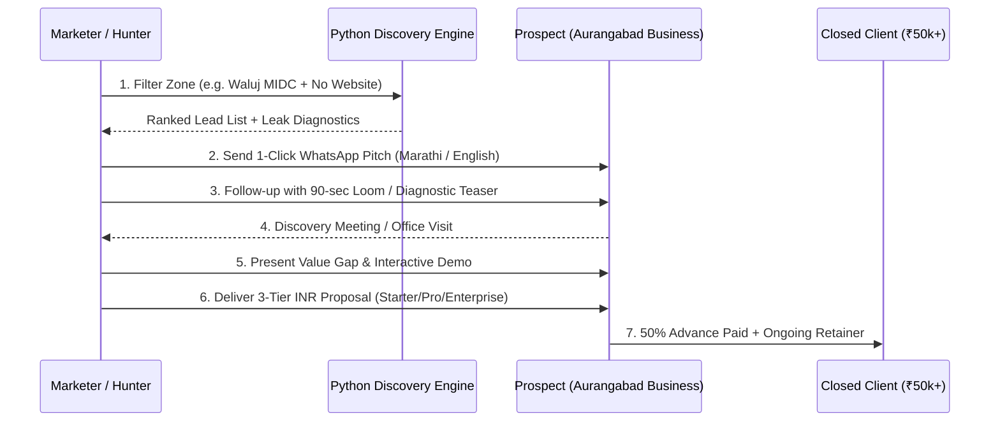

# The Aurangabad Website Client Hunting Playbook
### Strategy & Execution Blueprint for Closing High-Ticket Web & Growth Contracts in Chhatrapati Sambhajinagar, Maharashtra

---

## 1. Local Economic Landscape & Target Zones

Aurangabad (Chhatrapati Sambhajinagar) is the industrial capital of Marathwada and a massive economic engine with over ₹60,000+ Crore in manufacturing, pharma, automotive, healthcare, and educational commerce.

### Priority Geographical Clusters:
| Zone | Sector Dominance | Client Profile | Target Deal Size (INR) |
| :--- | :--- | :--- | :--- |
| **Waluj MIDC (Sector A-K)** | Auto components, Sheet metal, Precision tooling | Tier-1 & Tier-2 OEM suppliers to Bajaj, Skoda, Greaves | **₹45,000 – ₹1,25,000** |
| **Shendra DMIC / AURIC City** | Pharma, Heavy engineering, Global exports | Modern smart city industrial plants, MNC joint ventures | **₹75,000 – ₹2,00,000** |
| **Chikalthana MIDC & Airport Rd** | Pharmaceuticals, Biotech, Plastics, Electronics | High-turnover labs, packaging converters, chemical units | **₹50,000 – ₹1,50,000** |
| **Samarth Nagar & Nirala Bazar** | Healthcare, Coaching Hubs, High-end Boutiques | Doctors, Multi-speciality clinics, JEE/NEET classes | **₹30,000 – ₹70,000** |
| **Cannaught Place & CIDCO Town Centre** | IT firms, CA/Auditors, Paithani Silk Showrooms | Corporate consultants, solar EPCs, luxury retail | **₹35,000 – ₹90,000** |
| **Kranti Chowk & Station Road** | Hotels, Travel & Tour Agencies, Banquet Halls | Tourism operators serving Ajanta/Ellora, business hotels | **₹35,000 – ₹80,000** |
| **Beed Bypass & Garkheda** | Real Estate Developers, Luxury Banquets, Architects | Township builders, interior design studios | **₹60,000 – ₹1,80,000** |

---

## 2. The 7-Step High-Conversion Client Hunting Framework

---

## 3. High-Conversion Outreach Playbook

### Why WhatsApp is the #1 Channel in Maharashtra:
- Email open rates for local MSME owners in Aurangabad are ~12%.
- WhatsApp open rates are **>88%**, with a response rate within 45 minutes if the opening hook is respectful and localized.

### Multi-Touch Cadence:
- **Day 1 (Morning 10:30 AM - 11:30 AM)**: Send personalized WhatsApp message with specific observation (Marathi for traditional retail/local MSMEs, English for B2B exporters).
- **Day 3 (Afternoon 3:00 PM)**: Short video screenshot or 3-bullet leak audit ("Notice: Your site is showing 'Not Secure' on Chrome").
- **Day 5 (Morning 11:00 AM)**: Quick phone call to director or owner.
- **Day 8 (In-Person Drop-in for MIDC / Cannaught)**: Visiting the physical facility with a tablet / iPad showing an interactive live demo.

---

## 4. Packaging & Pricing Architecture (Aurangabad Market Specific)

| Tier | Target Audience | Key Deliverables | Price Range |
| :--- | :--- | :--- | :--- |
| **Tier 1: Starter Digital Launchpad** | Local Retailers, Dental Clinics, Single Doctors | 5-Page Fast Site, Mobile Viewport, 1-Click WhatsApp & Call, Google Business Profile Sync, Basic SEO | **₹18,000 – ₹25,000** |
| **Tier 2: Growth Business & Lead Engine** | Multi-Doctor Hospitals, Real Estate, Solar EPCs, Coaching | 10-15 Pages, Interactive Calculator / Booking System, Speed Optimization (<1.8s), High-Converting Landing Page, WhatsApp Automation | **₹38,000 – ₹65,000** |
| **Tier 3: Industrial B2B & Export Catalog** | Waluj & Shendra MIDC Manufacturers, Paithani Brands | Dynamic Product Catalog, Technical Spec PDF downloads, Multi-currency / RFQ (Request for Quote) system, ISO compliance layout | **₹75,000 – ₹1,60,000** |
| **Recurring Retainer: Growth Care** | All active clients | Cloud Hosting, SSL Renewal, Monthly Google Rank Reports, Speed & Security patches, 2 blog/case study updates | **₹4,500 – ₹15,000 / mo** |

---

## 5. Local Networking & Lead Multipliers

1. **CMIA (Chamber of Marathwada Industries and Agriculture)**: Attend industrial exhibitions and monthly networking meets at Railway Station Road.
2. **MASSIA (Marathwada Association of Small Scale Industries & Agriculture)**: Direct access to 2,000+ Waluj and Chikalthana unit owners.
3. **BNI Sambhajinagar Chapters (BNI Champions, BNI Royals)**: Weekly referral breakfasts where local business owners actively pass leads.
4. **CREDAI Aurangabad**: Builders & developer summits along Jalna Road & Beed Bypass.
